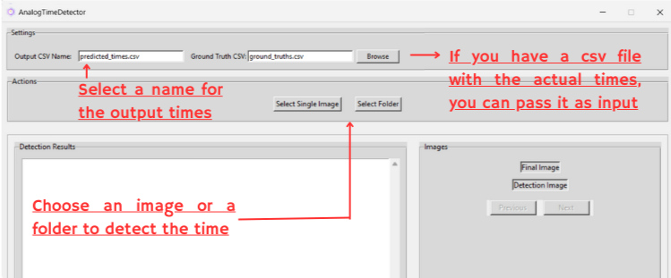
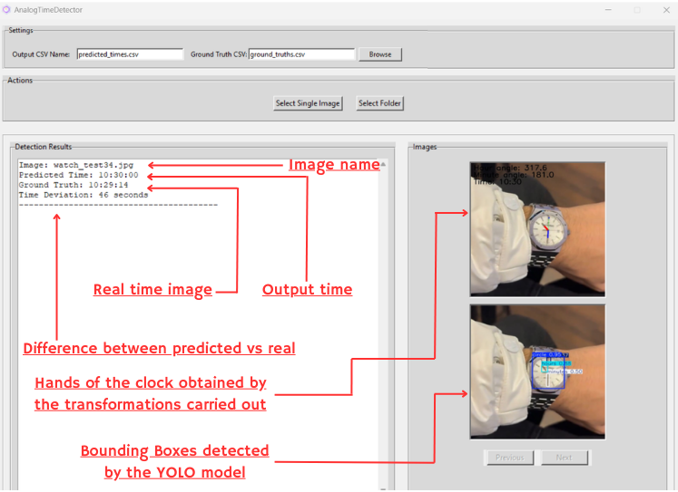

# AnalogTimeDetector

## Introduction

This project focuses on detecting the time shown on analog clocks from images using computer vision techniques. It is designed to handle images of analog clock faces, extracting key components like the clock circle, hour hand, minute hand, second hand (if present), and the position of the number 12. 

### Datasets Used
The following datasets contributed to training and validation (not all images were used):
- [Watche Image Dataset](https://www.kaggle.com/datasets/ahedjneed/fancy-watche-images)
- [A Dataset of Watches](https://www.kaggle.com/datasets/mathewkouch/a-dataset-of-watches)
- [Simple Analog Clock (Monochrome)](https://www.kaggle.com/datasets/kopfgeldjaeger/simple-analog-clock-monochrome/data)
- Additional images from screenshots of watch stores and Google searches.

### Technology Stack
- **Language**: Python
- **Libraries**: Specified in `requirements.txt`
- **Model**: YOLOv8/YOLOv11n for object detection

---

## How to Use

### 1. Preparing the Dataset
If you want to add new images to the training or validation datasets:
1. Add the new images to the following folders:
   - Training dataset: `dataset/images/train`
   - Validation dataset: `dataset/images/val`
2. Generate annotations for these images:
   - Use [labelImg](https://github.com/heartexlabs/labelImg) to create annotations. 
   - Draw bounding boxes for the following:
     - The **circle** of the clock
     - The **hour hand**
     - The **minute hand**
     - The **second hand** (if present)
     - The **label for the number 12** or any marker representing 12.

3. Convert the annotations from XML to TXT format using the following script:
```bash
   python annotations_utils/xml_to_txt.py
```
Save the converted annotations in:
  - `dataset/labels/train` for training
  - `dataset/labels/val` for validation


### 2. Training the Model
To train the model with the updated dataset:

1. Ensure the dataset configuration is defined in `dataset.yaml`.
2. Run the training script:
```bash
yolo task=detect mode=train data=dataset.yaml model=yolo11n.pt epochs=200 imgsz=640 device=0 lr0=1e-2 momentum=0.95 weight_decay=1e-3 label_smoothing=0.1 fliplr=0.5 hsv_h=0.05 hsv_v=0.4 scale=0.5 perspective=0.25
```
You can adjust parameters as needed.


### 3. Running the Application
To use the model for time detection:

1. Launch the app by running:
```bash
python main.py
```
The app provides a user-friendly GUI where you can:

- Select a single image or a folder containing multiple images for detection.
- Specify the name of the output CSV file where the detected times will be saved.
- View the detected time, and if available, compare it with the ground truth values.
- View the final image with the hands highlighted.
- View the detected components of the clock (circle, hour hand, minute hand, second hand, and 12 marker).

We have a function called `soft_nms` that is used to remove overlapping bounding boxes. This function is used to improve the detection of the hands of the clock. This function allows 3 methods to be used: `linear`, `gaussian`, and `hard`. The default method is `linear`. You can change the method by changing the value of the `soft_nms_method` variable in the `main.py` file.

### 4. Test Set

We have provided a test set in the `test_set` folder. You can use this set to evaluate the model's performance. The images in this folder are not part of the training or validation datasets and they are retired from X, Reddit and the last ones are photos taken by us.

### 5. Handling Ground Truths
If you have a file containing the actual times for the images:

1. Place the file in the ground_truths folder.
2. The app will display:
    - The detected time
    - The original time (ground truth)
    - The difference between the two times in seconds

## Important Notes
### Dependencies
Install all required dependencies by running:

```bash
pip install -r requirements.txt
```

### Detection Limitations
- The detection process may fail if the model cannot identify critical components, such as:
    - The hour hand
    - The label for 12

### Annotations
- Ensure that the annotations are precise and well-labeled to achieve optimal model performance.

### App Limitations
- For the images to appear correctly in the app, the names of the images must be in the format `watch_test<number>.jpg`. For example, `watch_test1.jpg`.

## Results
#### Outputs Generated by the App
1. Visual Outputs:
    - Processed images with detected hands and clock visualizations are saved in results/images.
2. CSV Report:
Predicted times are saved in results/files/<output_csv_name>.csv.

## Example

### Before Detection



### After Detection



